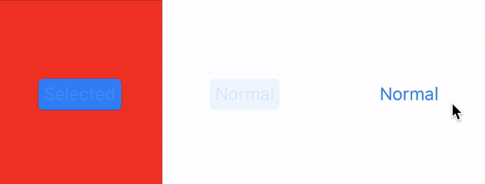
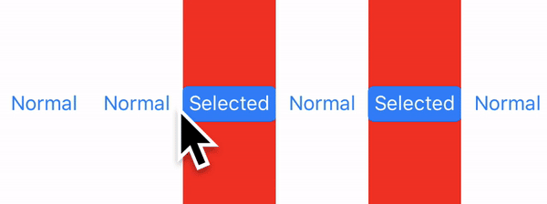

# LimitButtonSelect
[](http://cocoapods.org/pods/LimitButtonSelect)
[](https://github.com/younatics/Toggler/blob/master/LICENSE)
[](http://cocoapods.org/pods/LimitButtonSelect)
[](https://developer.apple.com/swift/)

## Intoduction



## Requirements

`LimitButtonSelect` is written in Swift 3. Compatible with iOS 9.0+

## Usage

The basic usage is to put the number of selectable buttons and buttons into an array.

```ruby
limitButtonSelect = LimitButtonSelect(limit: 1, buttons: [button1, button2, button3])
```

If you want to preselect it, you can use it as shown below.

```ruby
limitButtonSelect2 = LimitButtonSelect(limit: 3, buttons: [button4, button5, button6, button7, button8, button9], defaultIndex: [2,4])
```

When touching the button, use the on () method.
```ruby
limitButtonSelect2.on(button: sender)
```

When you want to return selected buttons, you can use the selectedButton () method.
## Installation

### Cocoapods

LimitButtonSelect is available through [CocoaPods](http://cocoapods.org). To install
it, simply add the following line to your Podfile:

```ruby
pod 'LimitButtonSelect'
```


## Author
[kaskay](https://github.com/kaskay)

## License
LimitButtonSelect is available under the MIT license.
